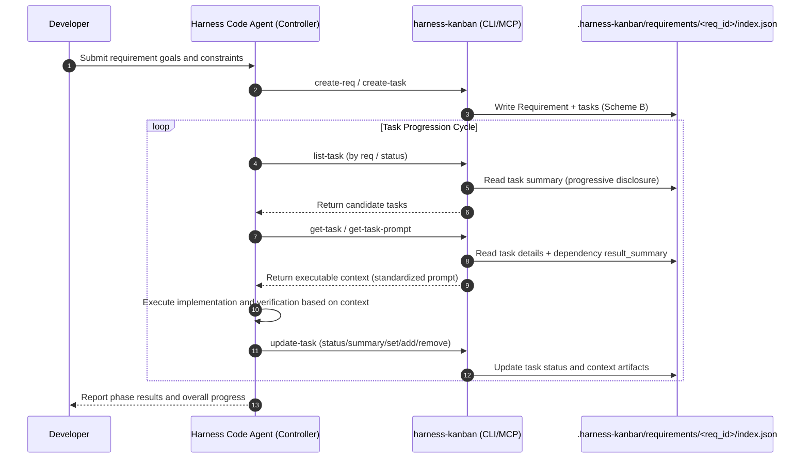

# @yrobot/harness-kanban

**English** | [中文](README.zh.md)

`@yrobot/harness-kanban` is a task management and context engineering tool designed for Harness Code (AI-driven development) workflows.

### Role and Purpose

In the Harness Code workflow, harness-kanban is the "information cornerstone" that ensures long-term stable AI output. Its core is: **task management + context engineering**.

- **Context carrier**: It not only stores and manages tasks, but ensures AI receives high-quality context through a process-driven approach — preventing context distortion or decay across long delivery chains.
- **Quality anchor**: By enforcing structured prompt strategies through `get-task-prompt`, it converges AI execution logic into predefined specifications, delivering more stable and higher-quality results.

## 1. End-to-End Harness Code Workflow



## 2. Core Strategy: AI Context Optimization

`harness-kanban` deeply integrates AI context management best practices to ensure the Agent maintains high stability when handling complex projects.

### 2.1 Context Management

- **Progressive Disclosure**: Agent first retrieves the task flow via `list-task` (titles and summaries only) for navigation. Only after selecting a target does it extract constraints, file mappings, and dependency artifacts via `get-task` or `get-task-prompt`. **Avoids flooding the Context Window with low-signal data.**

- **Context Pruning**: Uses `context_mapping` to explicitly bound the Agent's perception. Forces AI to focus on specific code slices, pruning unrelated modules.

- **Context Compression**: Distills large requirement documents into `background_chunk` and complex code changes into structured `result_summary`. Only passes "knowledge essence" through the task chain.

- **Structured Decomposition**: Forces development tasks into standard objects containing: **Constraints**, **Context Mapping**, and **Quantified Verification**.

### 2.2 Reliability Engineering

- **Deterministic Prompting**: `get-task-prompt` assembles instructions using fixed algorithmic logic. Task metadata is packaged via a structured template, ensuring the "input command" is always standard regardless of AI state fluctuations.

- **Logic vs Intelligence Separation**: Task scheduling and data management are implemented in 100% deterministic Node/TS code. The tool itself has no randomness — it provides the most stable scaffolding for AI.

## 3. Data Model

See the full data model and type definitions:

- `skills/harness-kanban/references/data-model.md`

Contains:

- Complete TypeScript type definitions for `Requirement` / `Task` / `RequirementSummary` / `TaskSummary`
- Requirement storage structure example (`.harness-kanban/requirements/<req_id>/index.json`)
- Summary vs full view: `list-req`/`list-task` return summaries; `get-req`/`get-task` return full details

## 4. Core Command: get-task-prompt

This is the key command — the execution engine for **context convergence**.

**Why it matters**: If AI reads the kanban JSON directly, it may get distracted by redundant task info. `get-task-prompt` performs:

1. **Auto-resolves dependencies**: Looks up `result_summary` from tasks in `dependencies`
2. **Assembles structured prompt**: Follows the golden standard of `Role → Context → Constraints → Output Requirements → Steps → Validations`
3. **Structured output**: A standardized prompt template (e.g., "## Background / ## Current Task / ## Constraints / ## Output Requirements / ## Steps / ## Validation Checklist") — stable and progressive

**This is the prerequisite for long-term stable high-quality AI output.**

## 5. Installation and Usage

### 5.1 CLI Installation

#### Global install (recommended)

```bash
npm i -g @yrobot/harness-kanban
# or
pnpm add -g @yrobot/harness-kanban
```

Then use directly:

```bash
harness-kanban --help
harness-kanban --version
```

#### One-off execution (no install)

```bash
npx -y @yrobot/harness-kanban --help
```

### 5.2 MCP Integration

Recommended to integrate in MCP-supporting clients (Cursor, Windsurf, etc.) to give the Agent native "kanban navigation" and "context retrieval" capabilities:

```json
{
  "mcpServers": {
    "harness-kanban": {
      "command": "npx",
      "args": ["-y", "@yrobot/harness-kanban", "mcp-server"]
    }
  }
}
```

### 5.3 Skill Installation

Install the project Skill:

```bash
npx skills add https://github.com/Yrobot/harness-kanban
```

- The Skill handles AI trigger logic and operation routing
- The CLI handles deterministic execution
- Project: `https://github.com/Yrobot/harness-kanban`
- AI manual: `skills/harness-kanban/SKILL.md`

## 6. CLI Reference

Command format: `harness-kanban [action-resource] [...props]`

### 6.0 CLI and MCP Consistency

- Each CLI command maps to a same-named core function, exposed to MCP
- CLI / MCP share the same parameter semantics, defaults, validation, and behavior
- Example: `create-task` maps to `createTask` (reused by MCP)

### 6.0.1 Error Output Format

When runtime errors occur, CLI and MCP output a unified error format:

- **CLI**: Errors output to `stderr` as `[CODE] message`, with `exitCode=1`
  - `[NOT_FOUND]`: Requirement or task does not exist
  - `[ALREADY_EXISTS]`: Attempting to create an already-existing resource
  - `[INVALID_INPUT]`: Parameter format error or missing required fields
  - `[INVALID_JSON]`: JSON parameter parsing failed
  - `[INTERNAL_ERROR]`: Other uncategorized errors

- **MCP**: Tool return includes `isError: true`, text content also uses `[CODE] message` format for AI Agent recognition

### 6.1 Command Parameters and Examples

Full command parameters and usage examples:

- [commands.md](skills/harness-kanban/references/commands.md)

Covers:

- All Requirement / Task commands
- Global parameters and array/object field passing semantics
- Common CLI invocation examples

## 7. Features

**Ultimate Stability**: Implemented in Node/TS — no AI logic judgments. Every line of prompt and every state change provided by this tool is 100% controllable.

**Git-Driven Sync**: Data travels with code. Through the `.harness-kanban` folder, human developers can review AI task states and context management logic just like reviewing code.

**Zero-Config Startup**: No complex database environment needed. Supports seamless switching between local (in-project) and global (`~/.harness-kanban`) storage.
