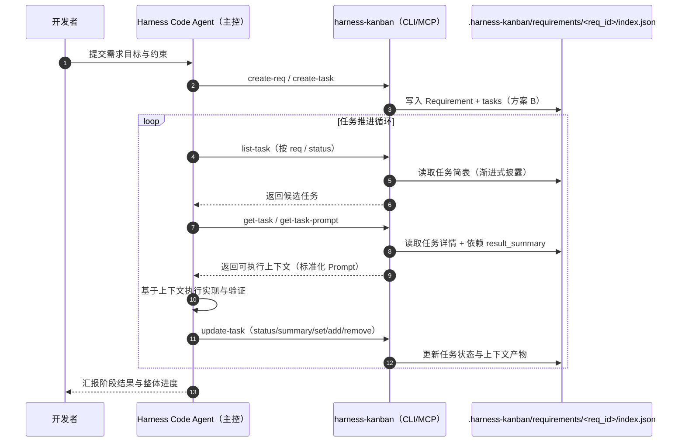

# @yrobot/harness-kanban

`@yrobot/harness-kanban` 是一个专为 Harness Code (AI 驱动开发) 场景设计的任务管理与上下文工程工具

### 工具角色与作用

在 Harness Code 流程中，harness-kanban 是确保 AI 长期稳定产出的“信息基石”，其核心是：**任务管理 + 上下文工程**

- **上下文载体**：它不仅存储管理任务，更用流程化的方式确保 AI 获取的上下文是高质量的，确保上下文在长链路交付中不失真、不腐败
- **质量锚点**：通过 `get-task-prompt` 强制执行结构化提示词策略，将 AI 的执行逻辑收敛在预设的规范内，致力于让 AI 产出更稳定高质量的结果

## 1. Harness Code 端到端流程



## 2. 核心策略：AI 上下文优化

`harness-kanban` 深度集成了各种 AI 上下文管理的最优范式，确保 Agent 在处理复杂项目时依然保持极高的稳定性

### 2.1 上下文管理策略 (Context Management)

- **渐进式披露 (Progressive Disclosure)**： 支持 Agent 分层获取信息。Agent 首先通过 `list-task` 检索任务流（仅包含标题与简介）进行任务导航；只有在选定目标后，才通过 `get-task` 或 `get-task-prompt` 提取该任务的约束、文件映射及依赖产物。**避免全量任务数据一次性涌入，造成 Context Window 的信噪比下降。**

- **上下文剪枝 (Context Pruning)**： 利用 `context_mapping` 显式限定 Agent 的感知边界。通过指令强制 AI 只关注特定代码分片，剪掉不相关的模块干扰

- **上下文压缩与精简 (Context Compression)**： 将庞大的需求文档提炼为 `background_chunk`，将复杂的代码变动总结为结构化的 `result_summary`。在任务链条中，只传递“知识的精华”，而非“过程的废话”

- **任务结构化分解 (Structured Decomposition)**： 将研发任务强制拆解为包含：**约束条件 (Constraints)**、**上下文映射 (Context)**、**量化验收 (Verification)** 的标准对象

### 2.2 执行稳定性策略 (Reliability Engineering)

- **确定性 Prompt 生成 (Deterministic Prompting)**： `get-task-prompt` 采用固定的算法逻辑拼装指令。它将任务元数据通过结构化模板封包，确保无论 AI 状态如何波动，接收到的“入参指令”永远是标准格式

- **逻辑与智能剥离**： 底层任务调度和数据管理由 100% 确定性的 Node/TS 代码实现。工具本身不具备随机性，只为 AI 提供最稳固的脚手架

## 3. 数据模型设计

### 3.1 Requirement 存储结构

每个 requirement 目录下仅有一个 `index.json`，用于存储该 Requirement 的完整数据。

- 存储路径示例：`.harness-kanban/requirements/<req_id>/index.json`
- 结构方案：

```json
{
  "id": "20260101120000",
  "title": "用户中心",
  "description": "处理登录注册",
  "status": "developing",
  "tasks": [
    {
      "id": "t_000001",
      "title": "API 开发",
      "context_mapping": ["src/api/*"],
      "background_chunk": "...",
      "dependencies": [],
      "constraints": [],
      "verification_steps": [],
      "status": "todo"
    }
  ]
}
```

### 3.2 核心类型定义 (TypeScript)

```ts
/** 需求：定义一个功能的整体边界 */
interface Requirement {
  id: ReqId; // 唯一标识，格式为 YYYYMMDDHHmmss，同 Requirement 文件夹名
  title: string;
  description: string;
  status: "planning" | "developing" | "completed";
  tasks: Task[]; // 任务以内嵌数组方式存储
}

/** 任务：AI 执行的最小单位，通过属性定义实现上下文管理策略 */
interface Task {
  id: TaskId; // 规则：t_xxxxxx，支持手动指定；未传时自动生成
  req_id: string;
  title: string;

  // --- 策略维度：上下文剪枝 (Context Pruning) ---
  /** 明确 Agent 必须加载和感知的代码路径 */
  context_mapping: string[];

  // --- 策略维度：上下文压缩 (Context Compression) ---
  /** 经过人工或 Agent 精简后的任务背景 */
  background_chunk: string;

  // --- 策略维度：渐进式披露 (Progressive Disclosure) ---
  /** 任务依赖链，用于在 Prompt 装配时注入所需上下文 */
  dependencies: string[];

  // --- 策略维度：任务结构化分解 (Structured Decomposition) ---
  /** 显式执行约束，收敛 AI 行为 */
  constraints: string[];

  /** 量化验收步骤，定义可量化的验收标准 */
  verification_steps: string[];

  // --- 状态与产出 ---
  status: "todo" | "in_progress" | "done" | "blocked";

  /** 交付摘要：该任务产出的结构化总结，将作为下游任务的上下文 */
  result_summary?: string;
}
```

## 4. 核心指令：get-task-prompt

这是 `harness-kanban` 很关键的命令，它是实现 **“上下文收敛”** 的具体执行引擎

**为什么它很重要？** 如果直接让 AI 读看板 JSON，它可能会被冗余的任务信息干扰。`get-task-prompt` 会执行以下逻辑：

1.  **自动检索依赖**：寻找 `dependencies` 中的 `result_summary`
2.  **装配结构化 Prompt**：按照 `Role -> Context -> Constraints -> Output Requirements -> Steps -> Validations` 的黄金标准拼装
3.  **结构化输出**：结构化的 Prompt 模板（如“## 需求背景 / ## 当前任务 / ## 约束条件 / ## 输出要求 / ## 执行步骤 / ## 验证清单”），确保输出的指令是稳定的、渐进式的

**这是 AI 长时间稳定产出高质量结果的前提。**

## 5. 接入方式

### 5.1 MCP (Model Context Protocol)

推荐在 Cursor, Windsurf 中接入，使 Agent 具备原生的“看板导航”与“上下文获取”技能

```json
{
  "mcpServers": {
    "harness-kanban": {
      "command": "npx",
      "args": ["-y", "@yrobot/harness-kanban", "mcp-server"]
    }
  }
}
```

### 5.2 Skill + CLI

```bash
npm i -g @yrobot/harness-kanban

harness-kanban --help
```

## 6. CLI 指令参考

命令格式：`harness-kanban [action-resource] [...props]`

### 6.0 CLI 与 MCP 一致性原则

- 每个 CLI 命令对应同名核心函数，并暴露给 MCP
- CLI / MCP 必须共享同一参数语义、默认值、校验与行为
- 例如：`create-task` 对应 `createTask`（并由 MCP 复用）

### 6.1 全局命令与配置 (Global)

#### --help / -h

- 介绍: 显示帮助信息，列出所有可用指令及说明
- 使用案例: `harness-kanban --help`

#### --version / -v

- 介绍: 查看当前安装的工具版本
- 使用案例: `harness-kanban --version`

#### --global / -g

- 介绍: 全局通用标识位。启用后，所有指令将操作用户主目录下的全局存储（`~/.harness-kanban`）
- 使用案例: `harness-kanban list-req --global`

#### 通用参数语义补充

- CLI 数组字段传参：默认使用 JSON 字符串，同时兼容逗号分隔
- CLI 对象字段传参：统一使用 JSON 字符串

### 6.2 Requirement (req) 管理

#### create-req

- 介绍: 初始化一个开发需求
- 参数解析:
  - `<title>` (string): 需求名称
  - `--id` (string): 唯一标识符（格式 YYYYMMDDHHmmss）
  - `--description` (string): 需求的详细业务背景
- 使用案例: `harness-kanban create-req "用户中心" --id 20260101120000 --description "处理登录注册"`

#### list-req

- 介绍: 展示需求列表，支持按状态过滤，作为 Agent 导航的第一层
- 参数解析:
  - `--status` (string): 状态过滤 (planning|developing|completed)
- 使用案例: `harness-kanban list-req --status developing`

#### get-req

- 介绍: 查询指定需求的完整信息及其内嵌任务列表
- 参数解析:
  - `<id>` (string): 需求 ID
- 使用案例: `harness-kanban get-req 20260101120000`

#### delete-req

- 介绍: 级联删除需求及其下属的所有任务
- 参数解析:
  - `<id>` (string): 需求 ID
- 使用案例: `harness-kanban delete-req 20260101120000`

### 6.3 Task 管理

#### create-task

- 介绍: 在指定需求下创建原子化的 AI 任务
- 参数解析:
  - `--id` (string): 任务 ID，格式 `t_xxxxxx`，支持手动指定；未传时自动生成
  - `--req` (string): 关联的需求 ID
  - `--title` (string): 任务名称
  - `--context` (string): 文件映射路径（数组字段，JSON 字符串或逗号分隔）
  - `--tests` (string): 校验命令（数组字段，JSON 字符串或逗号分隔）
  - `--constraints` (string): 执行约束（数组字段，JSON 字符串或逗号分隔）
  - `--dependencies` (string): 依赖任务 ID（数组字段，JSON 字符串或逗号分隔）
  - `--background` (string): 任务背景摘要
- 使用案例:
  - `harness-kanban create-task --req 20260101120000 --title "API 开发" --context "[\"src/api/*\"]" --tests "[\"bun test\"]"`
  - `harness-kanban create-task --req 20260101120000 --title "API 开发" --context "src/api/*,src/shared/*"`

#### list-task

- 介绍: 渐进式披露：获取特定需求下的任务简要列表，用于 Agent 执行路径规划
- 参数解析:
  - `--req` (string): 需求 ID
  - `--status` (string): 状态过滤 (todo|in_progress|done|blocked)
- 使用案例: `harness-kanban list-task --req 20260101120000 --status todo`

#### get-task

- 介绍: 精确获取单个任务的详细元数据和执行策略
- 参数解析:
  - `<id>` (string): 任务 ID
- 使用案例: `harness-kanban get-task t_000001`

#### update-task

- 介绍: 更新任务状态与任务字段，支持整体替换与增量操作（add/remove）
- 参数解析:
  - `<id>` (string): 任务 ID
  - `--status` (string): 目标状态 (todo|in_progress|done|blocked)
  - `--summary` (string): 供下游任务使用的结构化交付总结
  - `--set` (string): 对字段进行整体替换（对象字段，JSON 字符串）
  - `--add` (string): 对数组字段执行增量添加（对象字段，JSON 字符串）
  - `--remove` (string): 对数组字段执行增量删除（对象字段，JSON 字符串）
- 使用案例:
  - `harness-kanban update-task t_000001 --status done --summary "完成接口实现"`
  - `harness-kanban update-task t_000001 --add "{\"dependencies\":[\"t_000000\"]}"`
  - `harness-kanban update-task t_000001 --remove "{\"constraints\":[\"禁止修改接口\"]}"`

#### get-task-prompt

- 介绍: 核心指令。装配并生成高度收敛的标准化 Prompt，直接驱动 AI 工作
- 参数解析:
  - `<id>` (string): 任务 ID
- 输出格式:
  - markdown 格式结构化的 Prompt 模板（如“## 需求背景 / ## 当前任务 / ## 约束条件 / ## 输出要求 / ## 执行步骤 / ## 验证清单”）
- 使用案例: `harness-kanban get-task-prompt t_000001`

#### delete-task

- 介绍: 从需求中移除特定任务
- 参数解析:
  - `<id>` (string): 任务 ID
- 使用案例: `harness-kanban delete-task t_000001`

## 7. 工具特性

**极致稳定性**：由 Node/TS 编码实现，不依赖 AI 进行逻辑判断。作为底层工具，它提供的每一行 Prompt、每一个状态变更都是 100% 可控的

**Git 驱动同步**：数据随代码走。通过 .harness-kanban 文件夹，人类开发者可以像 Review 代码一样 Review AI 的任务状态和上下文管理逻辑

**零配置启动**：无需复杂的数据库环境，支持局部（项目内）与全局（~/.harness-kanban）存储无缝切换
