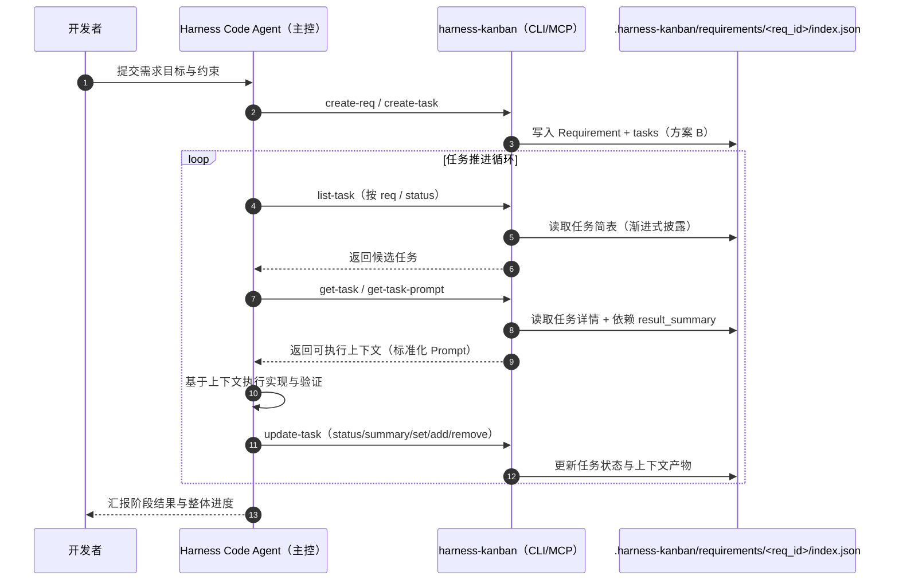

# @yrobot/harness-kanban

**中文** | [English](README.md)

`@yrobot/harness-kanban` 是一个专为 Harness Code (AI 驱动开发) 场景设计的任务管理与上下文工程工具

### 工具角色与作用

在 Harness Code 流程中，harness-kanban 是确保 AI 长期稳定产出的“信息基石”，其核心是：**任务管理 + 上下文工程**

- **上下文载体**：它不仅存储管理任务，更用流程化的方式确保 AI 获取的上下文是高质量的，确保上下文在长链路交付中不失真、不腐败
- **质量锚点**：通过 `get-task-prompt` 强制执行结构化提示词策略，将 AI 的执行逻辑收敛在预设的规范内，致力于让 AI 产出更稳定高质量的结果

## 项目结构声明与约定

为保证 CLI / MCP 行为一致、上下文能力可复用，项目采用分层约定：

- `src/interface`：唯一对外业务能力层。所有命令能力只在此层暴露。
- `src/bin`：CLI 胶水层。只做命令映射、参数解析、输出格式化，再调用 `src/interface`。
- `src/mcp`：MCP 胶水层。只做 tool schema/input 解析与返回格式，再调用 `src/interface`。
- `src/core`：领域模型、校验、存储等内部实现，不直接作为对外能力入口。
- `src/utils`：纯函数通用能力（无 I/O、无全局可变状态依赖）。

### interface 命名约定（与 CLI 命令一一对应）

比如：`create-req` -> `src/interface/createReq.ts`

## 1. Harness Code 端到端流程



## 2. 核心策略：AI 上下文优化

`harness-kanban` 深度集成了各种 AI 上下文管理的最优范式，确保 Agent 在处理复杂项目时依然保持极高的稳定性

### 2.1 上下文管理策略 (Context Management)

- **渐进式披露 (Progressive Disclosure)**： 支持 Agent 分层获取信息。Agent 首先通过 `list-task` 检索任务流（仅包含标题与简介）进行任务导航；只有在选定目标后，才通过 `get-task` 或 `get-task-prompt` 提取该任务的约束、文件映射及依赖产物。**避免全量任务数据一次性涌入，造成 Context Window 的信噪比下降。**

- **上下文剪枝 (Context Pruning)**： 利用 `context_mapping` 显式限定 Agent 的感知边界。通过指令强制 AI 只关注特定代码分片，剪掉不相关的模块干扰

- **上下文压缩与精简 (Context Compression)**： 将庞大的需求文档提炼为 `background_chunk`，将复杂的代码变动总结为结构化的 `result_summary`。在任务链条中，只传递“知识的精华”，而非“过程的废话”

- **任务结构化分解 (Structured Decomposition)**： 将研发任务强制拆解为包含：**约束条件 (Constraints)**、**上下文映射 (Context)**、**量化验收 (Verification)** 的标准对象

### 2.2 执行稳定性策略 (Reliability Engineering)

- **确定性 Prompt 生成 (Deterministic Prompting)**： `get-task-prompt` 采用固定的算法逻辑拼装指令。它将任务元数据通过结构化模板封包，确保无论 AI 状态如何波动，接收到的“入参指令”永远是标准格式

- **逻辑与智能剥离**： 底层任务调度和数据管理由 100% 确定性的 Node/TS 代码实现。工具本身不具备随机性，只为 AI 提供最稳固的脚手架

## 3. 数据模型设计

完整数据模型与类型定义请参考：

- `skills/harness-kanban/references/data-model.md`

该文档包含：

- `Requirement` / `Task` 完整 TypeScript 类型定义
- Requirement 存储结构示例（`.harness-kanban/requirements/<req_id>/index.json`）

## 4. 核心指令：get-task-prompt

这是 `harness-kanban` 很关键的命令，它是实现 **“上下文收敛”** 的具体执行引擎

**为什么它很重要？** 如果直接让 AI 读看板 JSON，它可能会被冗余的任务信息干扰。`get-task-prompt` 会执行以下逻辑：

1.  **自动检索依赖**：寻找 `dependencies` 中的 `result_summary`
2.  **装配结构化 Prompt**：按照 `Role -> Context -> Constraints -> Output Requirements -> Steps -> Validations` 的黄金标准拼装
3.  **结构化输出**：结构化的 Prompt 模板（如“## 需求背景 / ## 当前任务 / ## 约束条件 / ## 输出要求 / ## 执行步骤 / ## 验证清单”），确保输出的指令是稳定的、渐进式的

**这是 AI 长时间稳定产出高质量结果的前提。**

## 5. 安装与使用

### 5.1 CLI 安装

#### 全局安装（推荐）

```bash
npm i -g @yrobot/harness-kanban
# 或
pnpm add -g @yrobot/harness-kanban
```

安装后可直接使用：

```bash
harness-kanban --help
harness-kanban --version
```

#### 临时执行（免安装）

```bash
npx -y @yrobot/harness-kanban --help
```

### 5.2 MCP 接入

推荐在 Cursor、Windsurf 等支持 MCP 的客户端中接入，使 Agent 具备原生的“看板导航”与“上下文获取”能力：

```json
{
  "mcpServers": {
    "harness-kanban": {
      "command": "npx",
      "args": ["-y", "@yrobot/harness-kanban", "mcp-server"]
    }
  }
}
```

### 5.3 Skill 安装

推荐使用 Skills 方式安装本项目 Skill：

```bash
npx skills add https://github.com/Yrobot/harness-kanban
```

说明：

- Skill 负责 AI 触发逻辑与操作路由
- CLI 负责底层确定性执行能力
- 项目地址：`https://github.com/Yrobot/harness-kanban`
- AI 操作手册：`skills/harness-kanban/SKILL.md`

## 6. CLI 指令参考

命令格式：`harness-kanban [action-resource] [...props]`

### 6.0 CLI 与 MCP 一致性原则

- 每个 CLI 命令对应同名核心函数，并暴露给 MCP
- CLI / MCP 必须共享同一参数语义、默认值、校验与行为
- 例如：`create-task` 对应 `createTask`（并由 MCP 复用）

### 6.0.1 错误输出格式

CLI 和 MCP 在运行时发生错误时，会输出统一的错误格式：

- **CLI 端**：错误信息输出到 `stderr`，格式为 `[CODE] message`，并返回 `exitCode=1`
  - `[NOT_FOUND]`：需求或任务不存在
  - `[ALREADY_EXISTS]`：尝试创建已存在的资源
  - `[INVALID_INPUT]`：参数格式错误或缺失必填字段
  - `[INVALID_JSON]`：JSON 参数解析失败
  - `[INTERNAL_ERROR]`：其他未分类错误

- **MCP 端**：工具返回结果中会包含 `isError: true` 标识，文本内容同样采用 `[CODE] message` 格式，便于 AI Agent 识别和处理

### 6.1 命令参数与示例

完整命令参数与使用案例请参考：

- `skills/harness-kanban/references/commands.md`

该文档覆盖：

- 全部 Requirement / Task 命令
- 全局参数与数组/对象字段传参语义
- 常见 CLI 调用示例

## 7. 工具特性

**极致稳定性**：由 Node/TS 编码实现，不依赖 AI 进行逻辑判断。作为底层工具，它提供的每一行 Prompt、每一个状态变更都是 100% 可控的

**Git 驱动同步**：数据随代码走。通过 .harness-kanban 文件夹，人类开发者可以像 Review 代码一样 Review AI 的任务状态和上下文管理逻辑

**零配置启动**：无需复杂的数据库环境，支持局部（项目内）与全局（~/.harness-kanban）存储无缝切换
